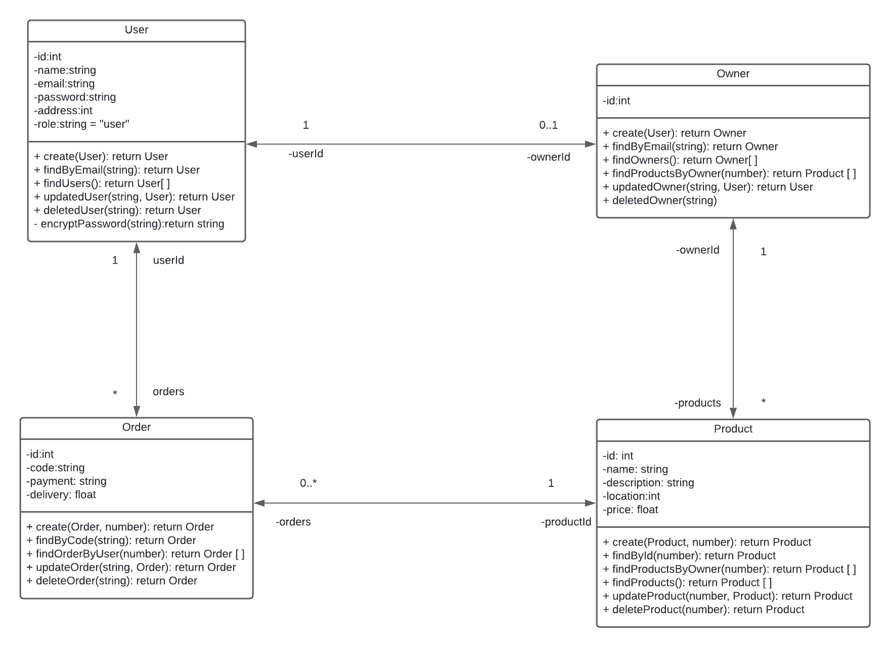
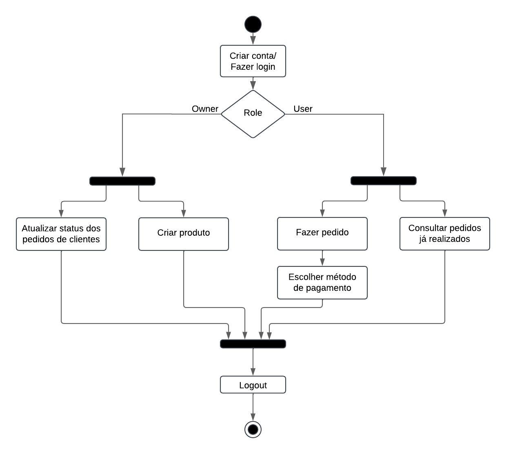

# Trabalho prático 1 de Engenharia de Software - JibLog

### Objetivo e principais features
O objetivo do trabalho é implementar um sistema de entregas que conecta os usuários que desejam enviar ou receber um produto, cujas principais features serão:
- cadastro de usuários e de estabelecimentos
- autenticação dos usuários
- indicação do tempo de entrega estimado
- seleção do método de pagamento
- status dos pedidos do usuário 
- sistema de avaliação da entrega, do produto e do fornecedor

### Membros da equipe e papéis
Beatriz Reis Gama Barbosa: desenvolvedor back-end  
Izadora Monkem Ganem: desenvolvedor front-end   
João Lucas Simões Moreira: desenvolvedor fullstack   

### Tecnologias
- Front-end: HTML, CSS e TypeScript
- Back-end: Node e TypeScript (gestão: Postman)
- Banco de dados: SQLite + Prisma (gestão: Prisma Studio)

### Backlog do produto
- Como usuário/proprietário de estabelecimento, eu gostaria de me cadastrar no sistema
- Como proprietário de estabelecimento, eu gostaria de poder cadastrar meus produtos para realizar entregas e atualizar informações sobre a entrega do produto
- Como proprietário de estabelecimento, eu gostaria de cadastrar e a alocar meus funcionários para entregas
- Como usuário, eu gostaria de visualizar o tempo estimado para uma entrega e a localização do produto
- Como usuário, eu gostaria de poder escolher entre diversas formas de pagamento 
- Como usuário, eu gostaria de acompanhar em tempo real a entrega do meu produto
- Como usuário, eu gostaria de poder contatar diretamente a distribuidora responsável pela minha entrega
- Como usuário, eu gostaria de ter acesso a um sistema automatizado de atendimento ao consumidor
- Como usuário, eu gostaria de poder avaliar os serviços prestados
- Como usuário, eu gostaria de ter um espaço para postar possíveis reclamações e solicitações de reembolso 
- Como entregador, eu gostaria de poder avaliar o contato com os clientes
- Como entregador, eu gostaria de ter autonomia na escolha das áreas em que farei entregas
- Como entregador, eu gostaria de gerenciar minhas entregas vigentes e futuras

### Backlog da sprint
História #1: Como usuário/proprietário de estabelecimento, eu gostaria de me cadastrar no sistema
- Instalar banco de dados, node.js e Express [todos]
- Criar primeiras tabelas [João]
- Criar e testar uma primeira rota usando o Express [João e Beatriz]
- Implementar no backend a lógica de CRUD de proprietário e de usuário [Beatriz]
- Implementar no backend a autenticação [Beatriz]
- Implementar versão inicial da tela principal [Izadora]
- Adaptar tela principal para criação e login de usuário [Izadora]
- Integrar o frontend e o backend [João]
  
História #2: Como proprietário de estabelecimento, eu gostaria de poder cadastrar meus produtos para realizar entregas e atualizar informações sobre a entrega do produto
- Implementar no backend a lógica de CRUD de produto [João e Beatriz]
- Implementar no backend a lógica de busca de produtos [Beatriz]
- Implementar no backend a atualização dos dados de um produto [Beatriz]
- Criar no frontend a tela de cadastro [Izadora]
- Criar no frontend a tela de busca de produtos [Izadora]
- Criar no frontend a tela para que o proprietário atualize os dados do produto [Izadora]
- Integrar o frontend e o backend [João]

História #3: Como usuário, eu gostaria de visualizar o tempo estimado para uma entrega e a localização do produto
- Integrar a API do Google Maps ao frontend do sistema [João]
- Criar no frontend a tela para que o usuário visualize os dados do produto [Izadora]
- Integrar o frontend e o backend [Beatriz]
  
História #4: Como usuário, eu gostaria de poder escolher entre diversas formas de pagamento 
- Implementar no backend o formulário de inserção de dados de pagamento [Beatriz]
- Criar no frontend a tela de seleção da forma de pagamento [Izadora]
- Integrar o frontend e o backend [João]
- 

### Diagramas UML

		
	

 	
Diagrama 1: Diagrama de classes, representando a estrutura e a organização do sistema JibLog.

		
	

 	
Diagrama 2: Diagrama de atividades, representando o fluxo de execução do sistema JibLog.

### Instruções de compilação
Para executar o programa e visualizar nosso site, são necessários 3 passos:

- No diretório raiz, execute `npm install` no terminal;
- Ainda no diretório raiz, execute `npm start` no terminal;
- Para abrir o site, é necessário instalar a extensão "Live Server" na sua IDE. 

Tendo obtido a extensão, basta abrir o arquivo "index.html" com a opção "Open with Live Server".
